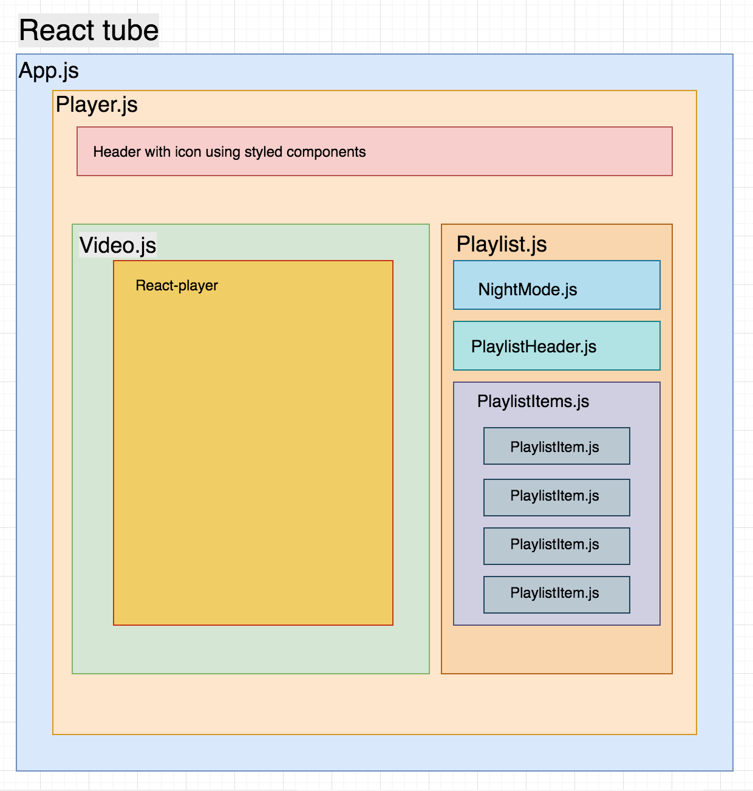

React Tube project is bootstrapped with [Create React App](https://github.com/facebook/create-react-app).

#### `npm start`

Runs the app in the development mode. 
Open [http://localhost:3000](http://localhost:3000) to view it in the browser.

## Dependencies 
* <b>react-player</b> - A React component for playing a variety of URLs, including file paths, YouTube, Facebook, Twitch, SoundCloud, Streamable, Vimeo, Wistia, Mixcloud, and DailyMotion. 
    
    #### `npm i -s react-player`

* <b>react-router-dom</b> -DOM bindings for React Router.
    
    #### `npm i -s react-router-dom`

* <b>styled-components</b> - It helps you to write actual CSS code to style your components. You can pass props to use same styled based on conditions like in js
    
    #### `npm i -s styled-components`

* <b>font-family</b> - Using google fonts family hind

    #### `https://fonts.googleapis.com/css?family=Hind:700`

## Features of react Tube
* 
Built using react 16.8 latest version

* 
Navbar/Header with icon

* 
Fetching Videos from local DB(Stubbed)

* 
Toggle switch to change the Night mode

* 
Using react Hooks to change states

* 
Using localstorage presiting the previous data

* 
Auto navigation of video from one to another once it get over

* 
Green indication if you have watched the video

## React Tube component based structure

## Changelog

 * v0.2.0
   * Wrapped the Nightmode switch into `<Toolbar>` ([tomByrer]())

## `Thanks & references`

* Thanks to Udemy & Thomas Weibenfalk
* https://reactjs.org/docs/hooks-intro.html
